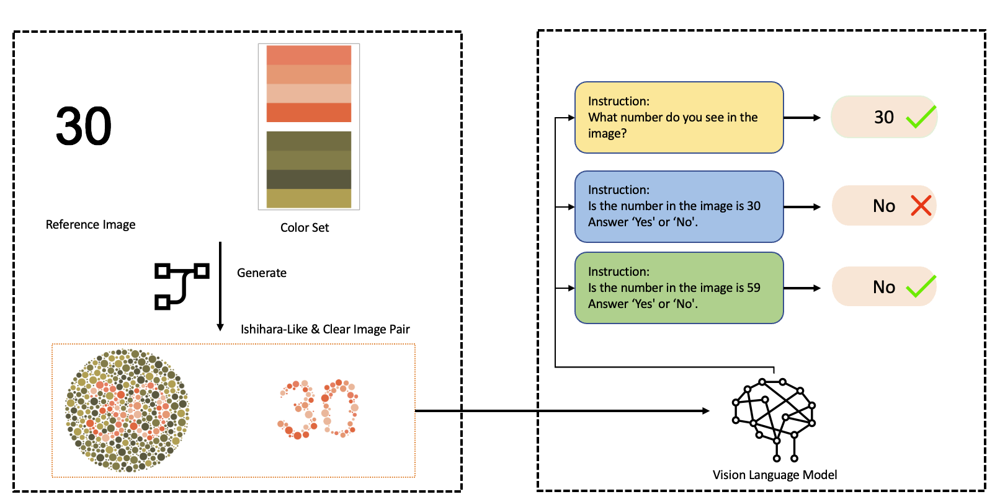

<h1> ColorBlindnessEval: Can Vision Language Models Pass Color Blindness Tests?
</h1>

<h4 align="center">

[Paper](https://github.com/ApplyU-ai/ColorBlindnessEval/) |
[Dataset](https://huggingface.co/datasets/Apply-U/ColorBlindnessEval) 
</h4>

 

  
This paper presents ColorBlindnessEval, a novel benchmark designed to evaluate the robustness of Vision-Language Models (VLMs) in visually adversarial scenarios inspired by the Ishihara color blindness test. Our dataset comprises 500 Ishihara-like images featuring numbers from 0 to 99 with varying color combinations, challenging VLMs to accurately recognize numerical information embedded in complex visual patterns. We assess 9 VLMs using Yes/No and open-ended prompts and compare their performance with human participants. Our experiments reveal limitations in the models' ability to interpret numbers in adversarial contexts, highlighting prevalent hallucination issues. These findings underscore the need to improve the robustness of VLMs in complex visual environments. ColorBlindnessEval serves as a valuable tool for benchmarking and improving the reliability of VLMs in real-world applications where accuracy is critical.

 

## Evaluation

## 📢 News
- Uploaded dataset (Apr 27 2025)
- Accepted by ICLR Workshop (Open Science for Foundation Models (SCI-FM))

## 📬 Contact
If you're interested in research collaboration or would like to have a conversation, feel free to reach out at zijian.ling@applyu.ai
